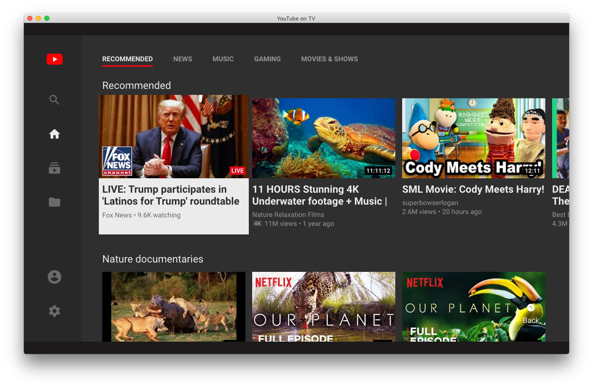

# Nativefier YouTube on TV for Desktop

This app allows you to use YouTube.com/tv (the YouTube interface for smart tvs and digital video players like Roku) on a desktop computer. It sets the user agent to Roku to prevent YouTube from redirecting to the standard desktop website like it would in a normal browser. It can be navigated with the arrow, enter, and escape keys.

## Downloads

| macOS                                                                                                                                      | Windows                                                                                                                                    | Linux                                                                                                                                      |
| ------------------------------------------------------------------------------------------------------------------------------------------ | ------------------------------------------------------------------------------------------------------------------------------------------ | ------------------------------------------------------------------------------------------------------------------------------------------ |
| 📦 [64 Bit (Intel)](https://github.com/mattruzzi/Nativefier-YouTube-on-TV-for-Desktop/releases/latest/download/YouTubeonTV-darwin-x64.zip) | 📦 [64 Bit (Intel)](https://github.com/mattruzzi/Nativefier-YouTube-on-TV-for-Desktop/releases/latest/download/YouTubeonTV-win32-x64.zip)  | 📦 [64 Bit (Intel)](https://github.com/mattruzzi/Nativefier-YouTube-on-TV-for-Desktop/releases/latest/download/YouTubeonTV-linux-x64.zip)  |
|                                                                                                                                            | 📦 [32 Bit (Intel)](https://github.com/mattruzzi/Nativefier-YouTube-on-TV-for-Desktop/releases/latest/download/YouTubeonTV-win32-ia32.zip) | 📦 [32 Bit (Intel)](https://github.com/mattruzzi/Nativefier-YouTube-on-TV-for-Desktop/releases/latest/download/YouTubeonTV-linux-ia32.zip) |
|                                                                                                                                            | 📦 [64 Bit (Arm)](https://github.com/mattruzzi/Nativefier-YouTube-on-TV-for-Desktop/releases/latest/download/YouTubeonTV-win32-arm64.zip)  | 📦 [64 Bit (Arm)](https://github.com/mattruzzi/Nativefier-YouTube-on-TV-for-Desktop/releases/latest/download/YouTubeonTV-linux-arm64.zip)  |

`brew cask install https://raw.githubusercontent.com/mattruzzi/Nativefier-YouTube-on-TV-for-Desktop/master/ytontv.rb`

[View all Releases](https://github.com/mattruzzi/Nativefier-YouTube-Roku-App-for-Desktop/releases)

## How to build

Install [Nativefier](https://github.com/jiahaog/nativefier#installation) and run `nativefier "https://youtube.com/tv" -u "Roku/DVP-9.10 (519.10E04111A)" -n "YouTube on TV" --electron-version $(npm show electron version)`.

## Screenshot

 
