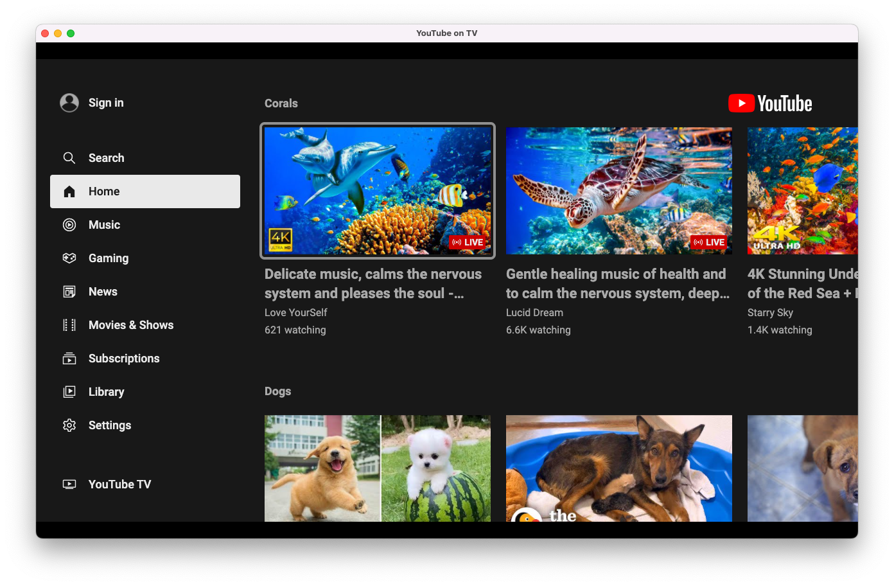

# Nativefier YouTube on TV for Desktop

> [!WARNING]
> Nativefier YouTube on TV for Desktop is an app generated with Nativefier. Nativefier is [no longer maintained](https://github.com/nativefier/nativefier/issues/1577), so updating Nativefier YouTube on TV for Desktop is no longer possible. Nativefier YouTube on TV for Desktop is therefore unmaintained and will not receive any updates. 

This app allows you to use YouTube.com/tv (the YouTube interface for smart tvs and digital video players like Roku) on a desktop computer. It sets the user agent to Roku to prevent YouTube from redirecting to the standard desktop website like it would in a normal browser. It can be navigated with the arrow, enter, and escape keys.

## Downloads

| macOS                                                                                                                                      | Windows                                                                                                                                    | Linux                                                                                                                                      |
| ------------------------------------------------------------------------------------------------------------------------------------------ | ------------------------------------------------------------------------------------------------------------------------------------------ | ------------------------------------------------------------------------------------------------------------------------------------------ |
| 📦 [64 Bit (Intel)](https://github.com/matthewruzzi/Nativefier-YouTube-on-TV-for-Desktop/releases/latest/download/YouTubeonTV-darwin-x64.zip) | 📦 [64 Bit (Intel)](https://github.com/matthewruzzi/Nativefier-YouTube-on-TV-for-Desktop/releases/latest/download/YouTubeonTV-win32-x64.zip)  | 📦 [64 Bit (Intel)](https://github.com/matthewruzzi/Nativefier-YouTube-on-TV-for-Desktop/releases/latest/download/YouTubeonTV-linux-x64.zip)  |
|                                                                                                                                            | 📦 [32 Bit (Intel)](https://github.com/matthewruzzi/Nativefier-YouTube-on-TV-for-Desktop/releases/latest/download/YouTubeonTV-win32-ia32.zip) | 📦 [32 Bit (Intel)](https://github.com/matthewruzzi/Nativefier-YouTube-on-TV-for-Desktop/releases/latest/download/YouTubeonTV-linux-ia32.zip) |
|                                                                                                                                            | 📦 [64 Bit (Arm)](https://github.com/matthewruzzi/Nativefier-YouTube-on-TV-for-Desktop/releases/latest/download/YouTubeonTV-win32-arm64.zip)  | 📦 [64 Bit (Arm)](https://github.com/matthewruzzi/Nativefier-YouTube-on-TV-for-Desktop/releases/latest/download/YouTubeonTV-linux-arm64.zip)  |

`brew install matthewruzzi/tap/ytontv`

[View all Releases](https://github.com/matthewruzzi/Nativefier-YouTube-Roku-App-for-Desktop/releases)

---

**Note:** nativefier-gui is not codesigned. Mac users will have to bypass gatekeeper to use it. 

Gatekeeper bypass instructions

 
 1. Right click the app and select open. 
 
 
 2. Click open. 
 
 

---

## How to build

Install [Nativefier](https://github.com/jiahaog/nativefier#installation) and run `nativefier "https://youtube.com/tv" -u "Roku/DVP-9.10 (519.10E04111A)" -n "YouTube on TV" --electron-version $(npm show electron version)`.

## Screenshot

 
